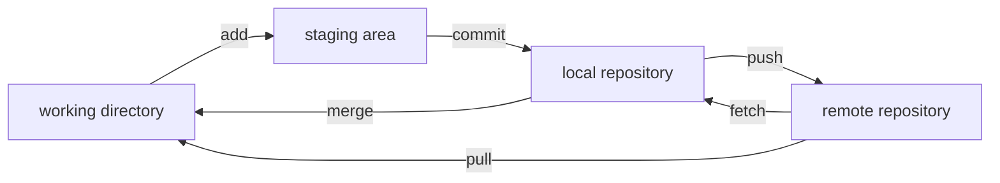
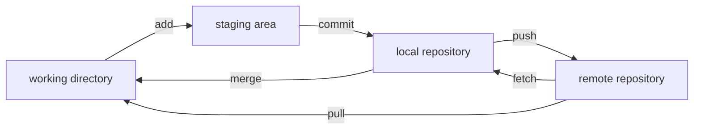

* TOC
{:toc}

jekyll-spaceship mermaid를 사용하게 되면 어쩌다가 다음과 같이 글자가 짤리는 것을 볼 수 있다.  


<br>
jekyll-spaceship이 default로 mermaid를 생성하는 방법은 [mermaid.ink](https://mermaid.ink/ )를 통해 link로 연결하는 것이기 때문에 [mermaid.ink github]()에서 issue를 확인해봤다.  


<br>
[이 issue](https://github.com/jihchi/mermaid.ink/issues/18 )의 내용을 통해서 애초에 [mermaid](https://github.com/mermaid-js/mermaid ) 자체의 원인임을 확인할 수 있었다.  

<br>
그래서 mermaid code block에 다음과 같은 code를 추가해주면 된다.  
```
%%{init: {"themeCSS": ".label foreignObject { font-size: 90% }"}}%%
```

<br>
위 코드를 적용해주니 글자가 짤리지 않는 모습을 확인할 수 있다.  

