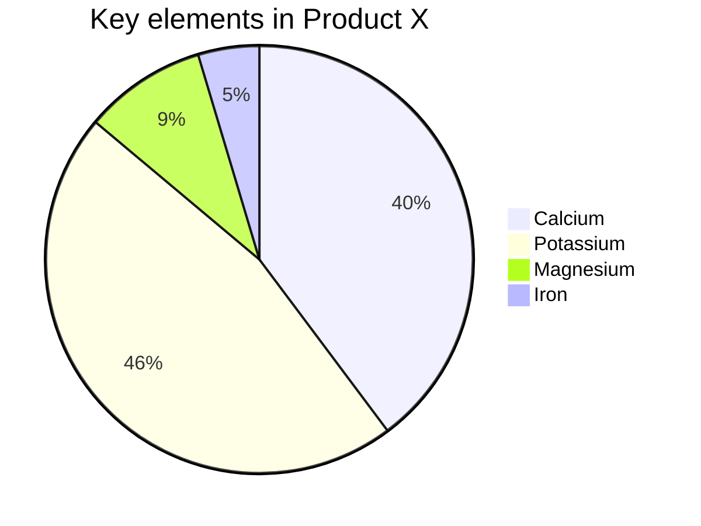

* TOC
{:toc}

## 0. syntax
- ``<command> + ` `` : 동일 app의 여러 윈도우 rotate (Cycle Through Windows)
- `<command> + space` : spotlight 검색


## 1. Table

| layer       | description |   |
|-------------|-------------|---|
| application | - build     |   |
|             | - aa        |   |
|-------------|-------------|---|
|             |             |   |

| 계층           | 설명   |     |
| :------------: | :----: | --- |
| application    |        |     |
| presentation   |        |     |
| session        |        |     |
| transport      |        |     |
| network        |        |     |
| data link      |        |     |
| physical       |        |     |


| Column 1          | Column 2       | Column 3      | Column 4       |
| ---------------   | :-----------   | :---------:   | :-----------   |
| Apple             | : Apple        | Apple :                       || \
| Banana            | Banana         | Banana                        || \
| Orange            | Orange         | Orange                        || 
| ----------------- | -------------- | ------------- | -------------- |
| First Row         | Some value     | Another       | 1. yoyo        |
|                   | ^^             | ^^            | ^^2. baz       |
|                   | ^^             | ^^            | ^^3. bar       |
| ----------------- | -------------- | ------------- | -------------- |
| Second row        | hey yo         | I'm cool      | Totally        |
| ----------------- | -------------- | ------------- | -------------- |
| Third  row        | asdf           | andmore       | sweet          |
{:.altTableClass}

<table>
  <tbody>
    <tr>
      <th>Tables</th>
      <th align="center">Are</th>
      <th align="right">Cool</th>
    </tr>
    <tr>
      <td>col 3 is</td>
      <td align="center">right-aligned</td>
      <td align="right">$1600</td>
    </tr>
    <tr>
      <td>col 2 is</td>
      <td align="center">centered</td>
      <td align="right">$12</td>
    </tr>
    <tr>
      <td>zebra stripes</td>
      <td align="center">are neat</td>
      <td align="right">$1</td>
    </tr>
    <tr>
      <td>
        <ul>
          <li>item1</li>
          <li>item2</li>
        </ul>
      </td>
      <td align="center">See the list</td>
      <td align="right">from the first column</td>
    </tr>
  </tbody>
</table>

| Fruit     | Price   | Advantages               |
| --------- | ------- | ------------------------ |
| Bananas   | $1.34   |    - built-in wrapper    |
|           |         | ^^ - bright color        |
|           |         | ^^ - - bright color      |
|           |         | ^^ - - bright color      |
|           |         | ^^ - - - bright color    |
| --------- | ------- | ------------------------ |
| Oranges   | $2.10   | 1. cures scurvy          |
|           |         | ^^ 1. 1. tasty           |

| process                                                              | thread                                                                      |
| -------------------------------------------------------------------- | --------------------------------------------------------------------------- |
| OS로부터 자원을 할당 받는 `작업의 단위`                              | 프로세스가 할당 받은 자원을 이용하는 `실행의 단위`                          |
| -------------------------------------------------------------------- | --------------------------------------------------------------------------- |
| - 프로그램에 대한 인스턴스                                           | - 프로세스 내에서 실제로 작업을 수행                                        \
| - - 프로그램 수행에 필요한 자원을 하나의 개체에서 관리               | - 하나의 프로세스 안에서 각각의 레지스터, 스택 공간을 제외한                \
| - 모든 프로세스에는 하나 이상의 쓰레드 존재                          | 나머지 공간(heap, data, bss, code)과 자원을 다른 쓰레드와 공유              \
| - 자신만의 고유 공간과 자원을 할당 받는다.                           | - 스택과 레지스터만 switching하므로 context switching 속도가 상대적으로 빠름\
| (메모리 공간과 자원 소모가 상대적으로 큼)                            | - 자원 공유로 인한 동기화 문제가 발생                                       \
|                                                                      | - 디버깅이 어려움                                                           |

| 1            |  2 |  3  |
|--------------|----|-----|
| ```cpp       | No | Yes \
| int main() { |    |     \
| }            |    |     \
| ```          |    |     |


|   Markdown   | Rendered HTML |
|--------------|---------------|
|    *Italic*  | *Italic*      \
|              |               |
|    - Item 1  | - Item 1      \
|    - Item 2  | - Item 2      |
|    ```python | ```python     \
|    .1 + .2   | .1 + .2       \
|    ```       | ```           |


## 2. code-block

```javascript
var x = 10;
document.getElementById("demo").innerTHML = x;
```


$ sudo su
# apt-get install nodejs npm


```cpp   
#include <cstdio>
int main()
{
	int ap = 10;
	cout << ap << endl;
	return 0;
}
   ```  


#include <cstdio>
int main()
{
	int x = 10;
	cout << x << endl;
	return 0;
}



## 3. plantuml
[GUIDE](http://plantuml.com/ko/guide)

- first  

  ```plantuml!
  [First] - [Third]
  ```

  - second  
 
    ```plantuml!
    (First usecase)
    (Another usecase) as (UC2)  
    usecase UC3
    usecase (Last\nusecase) as UC4
    ```


```plantuml!
:Main Admin: as Admin
(Use the application) as (Use)

User -> (Start)
User --> (Use)

Admin ---> (Use)

note right of Admin : This is an example.

note right of (Use)
  A note can also
  be on several lines
end note

note "This note is connected\nto several objects." as N2
(Start) .. N2
N2 .. (Use)
```


```plantuml!
participant Alice
actor Bob

ref over Alice, Bob : init

Alice -> Bob : hello

ref over Bob
	This can be on
	several lines
end ref
```


```plantuml!
participant User
User -> A: DoWork
activate A
A -> B: << createRequest >>
activate B
B -> C: DoWork
activate C
C --> B: WorkDone
destroy C
B --> A: RequestCreated
deactivate B
A -> User: Done
deactivate A
```

## 4. ditaa
[ditaa github](https://github.com/stathissideris/ditaa)


    +--------+   +-------+    +-------+
    |        | --+ ditaa +--> |       |
    |  Text  |   +-------+    |diagram|
    |Document|   |!magic!|    |       |
    |     {d}|   |       |    |       |
    +---+----+   +-------+    +-------+
        :                         ^
        |       Lots of work      |
        +-------------------------+



/----+  DAAP /-----+-----+ Audio  /--------+
| PC |<------| RPi | MPD |------->| Stereo |
+----+       +-----+-----+        +--------+
   |                 ^ ^
   |     ncmpcpp     | | mpdroid /---------+
   +--------=--------+ +----=----| Nexus S |
                                 +---------+
		


         +----------------------+
         |cPNK                  |
   +-----|  Dispatcher Servlet  |-----+
   |     |                      |     |
   |     +----------------------+     |
   |                                  |
   |  +-----------------------------+ |
   |  |Servlet WebApplicationContext| |
   |  |                             | |
   |  | +-----------+               | |
   |  | |Controllers|               | |
   |  | +-----------+               | |
   |  |            +--------------+ | |
   |  |            |HandlerMapping| | |
   |  |            +--------------+ | |
   |  |   +------------+            | |
   |  |   |ViewResolver|            | |
   |  |   +------------+            | |
   |  +-------------+---------------+ |
   |                |                 |
   |                |Delegates        |
   |                | if no bean found|
   |                |                 |
   |                v                 |
   |  +-----------------------------+ |
   |  | Root WebApplicationContext  | |
   |  |                             | |
   |  | +--------+  +------------+  | |
   |  | |Services|  |Repositories|  | | 
   |  | +--------+  +------------+  | |
   |  +-----------------------------+ |
   +----------------------------------+ 
		


## 5. mermaid
[mermaid website](https://mermaid-js.github.io/mermaid/#/)

- first  

  ```mermaid!
  graph TD
  	A['Christmas'] -->|Get money| B(Go shopping)
  	B --> C{Let me think}
  	C -->|One| D[Laptop]
  	C -->|Two| E[iPhone]
  	C -->|Three| F[fa:fa-car Car]
  ```

  - second  

    ```mermaid!
		%%{init: {"themeCSS": ".label foreignObject { font-size: 90% }"}}%%
    graph LR
    A[working directory] --> |add| B[staging area]
    B --> |commit| C[local repository]
    C --> |merge| A
    C --> |push| D[remote repository]
    D --> |fetch| C
    D --> |pull| A
    ```

    - third  

      ```mermaid!
      classDiagram
      classA --|> classB : Inheritance
      classC --* classD : Composition
      classE --o classF : Aggregation
      classG --> classH : Association
      classI -- classJ : Link(Solid)
      classK ..> classL : Dependency
      classM ..|> classN : Realization
      classO .. classP : Link(Dashed)
      ```

  - fourth  

    ```mermaid!
    gantt
           dateFormat  YYYY-MM-DD
           title Adding GANTT diagram functionality to mermaid
    	   excludes weekdays 2014-01-10
    
           section A section
           Completed task            :done,    des1, 2014-01-06,2014-01-08
           Active task               :active,  des2, 2014-01-09, 3d
           Future task               :         des3, after des2, 5d
           Future task2              :         des4, after des3, 5d
    
           section Critical tasks
           Completed task in the critical line :crit, done, 2014-01-06,24h
           Implement parser and jison          :crit, done, after des1, 2d
           Create tests for parser             :crit, active, 3d
           Future task in critical line        :crit, 5d
           Create tests for renderer           :2d
           Add to mermaid                      :1d
    
           section Documentation
           Describe gantt syntax               :active, a1, after des1, 3d
           Add gantt diagram to demo page      :after a1  , 20h
           Add another diagram to demo page    :doc1, after a1  , 48h
    
           section Last section
           Describe gantt syntax               :after doc1, 3d
           Add gantt diagram to demo page      :20h
           Add another diagram to demo page    :48h
    ```
	  



## 6. etc


