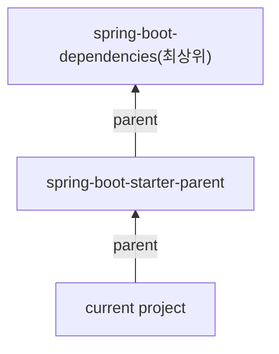

* TOC
{:toc}

## 1. 시작하기

### 1.1. Spring boot 소개
[https://docs.spring.io/spring-boot/docs/2.0.3.RELEASE/reference/htmlsingle/#getting-started-introducing-spring-boot](https://docs.spring.io/spring-boot/docs/2.0.3.RELEASE/reference/htmlsingle/#getting-started-introducing-spring-boot)
<br>

### 1.2. spring boot 시작하기
[https://docs.spring.io/spring-boot/docs/2.0.3.RELEASE/reference/htmlsingle/#getting-started-maven-installation](https://docs.spring.io/spring-boot/docs/2.0.3.RELEASE/reference/htmlsingle/#getting-started-maven-installation)
<br>

### 1.3. Sprint boot 프로젝트 생성기
[https://start.spring.io](https://start.spring.io)
<br>

### 1.4. 프로젝트 구조
[https://docs.spring.io/spring-boot/docs/current/reference/htmlsingle/#using-boot-structuring-your-code](https://docs.spring.io/spring-boot/docs/current/reference/htmlsingle/#using-boot-structuring-your-code)
<br><br>

- maven 기본 프로젝트 구조와 동일
	- 소스 코드 (src/main/java)
	- 소스 리소스 (src/main/resources)
	- 테스트 코드 (src/test/java)
	- 테스트 리소스 (src/test/resources)
 
- main application 위치 : 기본 패키지(default package)
	- component-scan을 해야하기 때문이다.(기본 패키지의 하위가 scan 대상)


## 2. 원리

### 2.1. 의존성 관리 

#### 2.1.1. 이해



spring-boot-dependencies의 pom.xml 내부 \<dependency management\> 항목에 버전들이 정의되어 있다. 이 버전들을 current project의 pom.xml에 명시하면 해당 버전에 따른 dependency를 사용할 수 있다.

spring-boot-starter-parent의 pom.xml 내부 \<properties\> 항목에 아래와 같이 정의되어 있다. 따라서, spring-boot-starter-parent를 쓰는 것을 권장한다.

- 1.8 Java version
- UTF-8 인코딩
- plugin configuration
- resource filtering 
- etc...


#### 2.1.2. 활용

- 버전 관리 해주는 의존성 추가
	- spring boot에서 관리하는 의존성이기 때문에 version을 명시하지 않아도 된다.  

		```xml  
		<dependency>
			<groupId>org.springframework.boot</groupId>
			<artifactId>spring-boot-starter-data-jpa</artifactId>
		</dependency>
		```  
		<br>
- 버전 관리 안 해주는 의존성 추가
	- 버전 관리가 되지 않아 의도치 않은 version이 들어올 수 있기 때문에 아래 코드와 같이 version을 명시해주는 것이 좋다. ([https://mvnrepository.com](https://mvnrepository.com) 참고)  

		```xml  
		<dependency>
			<groupId>org.modelmapper.boot</groupId>
			<artifactId>modelmapper</artifactId>
			<version>2.1.0</version>
		</dependency>
		```  
		<br>

- 기존 의존성 버전 변경하기
	- spring-boot-dependencies나 spring-boot-start-parent의 \<properties\>를 current project에서 다른 버전으로 overriding할 수 있다. 


### 2.2. 자동 설정

#### 2.2.1. 개요
- @EnableAutoConfiguration (@SpringBootApplication 안에 포함되어 있음)
	- 의존성 'spring-boot-autoconfigure'에서 설정된 이 Annotation으로 인해 application 실행 시 tomcat, jdbc, MongoDB 등이 자동으로 설정되는 것이다.  
	<br>
- 자동 설정에서 빈은 두 단계로 나뉘어서 등록된다.
	- 첫 번째 : @ComponentScan
		- 해당 annotation이 포함되어 있는 package에서 그 하위에 있는 모든 빈을 scan한다. (같은 또는 상위 레벨에 있는 package는 포함되지 않는다.)  
		- @Configuration, @Repository, @Service, @Controller, @RestController
	- 두 번째 : @EnableAutoConfiguration
		- spring.factories[^1]
			- org.springframework.boot.autoconfigure.EnableAutoConfiguration : 이 항목 하위에 명시되어 있는 모든 목록에 대해 자동으로 빈 등록을 시도한다.(그 모든 목록에 가보면 각각 @Configuration이 명시되어 있다.) 하지만, 각 목록에서 @ConditionalOnXxxYyyZzz 애노테이션에 따라 빈 등록 여부가 결정된다.

- 참고)
	- @SpringBootApplication : @COnfiguration, @EnableAutoConfiguration, @ComponentScan 3가지를 하나의 annotation으로 합친 것


#### 2.2.2. 자동 설정 만들기
https://docs.spring.io/spring-boot/docs/current/reference/htmlsingle/#boot-features-developing-auto-configuration

- 모듈(프로젝트)
	- xxx-spring-boot-Autoconfigure : 자동 설정 관련
	- xxx-spring-boot-starter : 필요한 의존성 정의
- 하나의 모듈로 만들고 싶을 때는? 
	- xxx-spring-boot-starter로 만든다.  
	<br>
- 구현 방법
	1. 프로젝트 생성
		- groupId : me.hoonti06
		- artifactId : hoon-spring-boot-starter  
		<br>
		- pom.xml에 아래와 같은 설정이 되어있다.  
		  
			```xml  
			<groupId>me.hoonti06</groupId>
			<artifactId>hoon-spring-boot-starter</artifactId>
			<version>0.0.1-SNAPSHOT</version>
			```  
			<br>
	2. 의존성 추가  
	   아래의 xml 코드를 pom.xml에 추가한다.  
	   
		```xml
		<dependencies>
			<dependency>
				<groupId>org.springframework.boot</groupId>
				<artifactId>spring-boot-autoconfigure</artifactId>
			</dependency>
			<dependency>
				<groupId>org.springframework.boot</groupId>
				<artifactId>spring-boot-autoconfigure-processor</artifactId> 
				<optional>true</optional>
			</dependency>
		</dependencies>

		<dependencyManagement>
			<dependencies>
				<dependency>
					<groupId>org.springframework.boot</groupId>
					<artifactId>spring-boot-dependencies</artifactId>
					<version>2.0.3.RELEASE</version>
					<type>pom</type>
					<scope>import</scope>
				</dependency>
			</dependencies>
		</dependencyManagement>
		```  
		<br>
	3. Class 파일 작성 및 @Configuration 적용
 
	4. src/main/resource/META-INF/spring.factories 파일에 자동 설정할 파일 이름(3.의 @Configuration 파일)을 명시  
	   (서비스 프로바이더와 비슷한 패턴(?))  
		- SpringbootEnableAutoConfiguration이 켜져 있으면 아래 리스트를 scan하게 된다.  
	   
			```
			org.springframework.boot.autoconfigure.EnableAutoConfiguration=\
			me.hoonti06.HolomanConfiguration
			```  
			<br>
	5. mvn install
		- 로컬 maven 저장소에 설치를 하게 된다.
	 
	6. 1.~5.을 통해 자동 설정을 작성한 프로젝트(1)를 다른 프로젝트(2)에 의존성으로 추가한다.
		- 1.의 xml 코드를 넣어 의존성을 추가하면 된다.
	 
	7. 프로젝트(2)에서 프로젝트(1)에서 생성한 빈을 사용한다.
		- 참고)  
		  프로젝트(1)의 클래스를 프로젝트(2)에서 사용할 때, package의 이름이 동일하면 바로 사용 가능하다.
 
	8. 프로젝트(2)에서 프로젝트(1)의 클래스로 로컬에서 빈을 등록하게 되면 적용이 되지 않고, 프로젝트(2)의 빈으로 등록된다.
		그 이유는 ComponentScan이 먼저 수행되어 로컬에서 먼저 빈을 등록하고 Auto Configuration이 그 다음 수행되어 프로젝트(2)의 빈으로 덮어쓰게 되기 때문이다.(overriding)
		- 참고)  
		  `Spring boot 2.1부터`는 overriding 옵션의 default 설정이 false여서 `에러가 발생`한다. 
		  src/main/resources/application.properties(또는 application.yml)에 'spring.main.allow-bean-definition-overriding: true' 옵션을 추가하면 된다.

<br>

- 덮어쓰기 방지
	- @ConditionalOnMissingBean (동일한 이름의 Bean이 등록 안 되어 있을 때만 해당 Bean을 등록한다는 의미)  
<br>
- 빈 재정의(redefinition)에 대한 수고 덜기
	- src/main/resources/application.properties에 property 값들을 설정한다.
		- e.g.  
		  holoman : prefix
		  
		  ```
		  holoman.name = helloman  
		  holoman.howLong = 5
		  ```  
		  <br>
	- HolomanProperties class에 @ConfigurationProperties("holoman")를 설정한다. ('holoman'이라는 prefix를 설정)
		- 해당 애노테이션을 사용하기 위해서는 spring-boot-configuration-processor 의존성을 추가해야 한다.  
	
			```xml
			<dependency>
				<groupId>org.springframework.boot</groupId>
				<artifactId>spring-boot-configuration-processor</artifactId>
				<optional>true</optional>
			</dependency>
			```  
			<br>
	- HolomanConfiguration class에 @EnableConfigurationProperties(HolomanProperties.class)를 설정하고,  
	  HolomanProperties instance를 통해 Holoman instance의 값을 초기화한다.
	  
	- 프로퍼티(application.properties)에 설정된 key값을 통해 자동 설정이 된다.


### 2.3. 내장 서블릿 컨테이너

#### 2.3.1.
- 스프링 부트는 서버가 아닌, Tool이다.(tomcat, netty 등이 서버에 해당한다.)
	- 아래 코드처럼 tomcat을 직접 실행할 수 있다.  
	  
		```{.java .numberLines}
		public class Application {
			public static void main(String[] args) throws LifecycleException {
				Tomcat tomcat = new Tomcat(); // 톰캣 객체 생성
				tomcat.setPort(8080); // 포트 설정			

				COntext context = tomcat.addContext("/", "/"); // 톰캣에 컨텍스트 추가

				// 서블릿 만들기
				HttpServlet servlet = new HttpServlet() {	
					@Override
					protected void doGet(HttpServletRequest req, HttpServletResponse resp) {
						PrintWrite writer = resp.getWriter();
						writer.println("<html><head><title>");
						writer.println("Hello Tomcat");
						writer.println("</title>");
						writer.println("<body><h1>Bye Tomcat</h1></body>");
						writer.println("</html>");
					}
				};

				string servletName = "helloServlet";
				tomcat.addServlet("/", servletName, servlet); // 톰캣에 서블릿 추가
				context.addServletMappingDecoded("/hello", servletName); // 컨텍스트에 서블릿 매핑

				// 톰캣 실행 및 대기
				tomcat.start();
				tomcat.getServer().await();
			}
		}
		```  
		<br>
	- 위 Java 코드의 과정들을 상세하고 유연하게 설정하고 실행해주는 것이 바로 Spring boot의 자동 설정  
	  (spring-boot-autoconfigure의 spring.factories에 등록되어 있다.)
		- SevletWebServerFactoryAutoConfiguration (서블릿 웹 서버(컨테이너) 생성)
			- TomcatServletWebServerFatoryCustomizer (서버 커스터마이징)
		- DispatcherServletAutoConfiguration
			- (Dispatcher) 서블릿을 만들고 등록
		- 참고)
		  위 내용처럼 '서블릿 웹 서버(컨테이너)를 생성하는 일'과 '서블릿을 생성하고 등록하는 일'이 분리되어 있다.   
		  서블릿은 바뀌지 않지만 컨테이너는 설정에 따라 달라질 수 있기 때문이다.

#### 2.3.2. 응용
- 다른 서블릿 컨테이너로 변경
	- Default 설정인 Tomcat을 빼고 Jetty를 적용할 수 있다. ([참고 Document](https://docs.spring.io/spring-boot/docs/current/reference/html/howto.html#howto-embedded-web-servers))  
	  
		```xml
		<properties>
			<servlet-api.version>3.1.0</servlet-api.version>
		</properties>
		<dependency>
			<groupId>org.springframework.boot</groupId>
			<artifactId>spring-boot-starter-web</artifactId>
			<exclusions>
				<!-- Exclude the Tomcat dependency -->
				<exclusion>
					<groupId>org.springframework.boot</groupId>
					<artifactId>spring-boot-starter-tomcat</artifactId>
				</exclusion>
			</exclusions>
		</dependency>
		<!-- Use Jetty instead -->
		<dependency>
			<groupId>org.springframework.boot</groupId>
			<artifactId>spring-boot-starter-jetty</artifactId>
		</dependency>
		```  
		<br>
- 웹 서버 사용하지 않기 
	- application.properties에 'spring.main.-application-type=none'을 설정한다.

- 포트 
	- 포트 지정
		- application.properties에 'server.port=7070'을 설정한다.
		- relaxed binding을 통해 Environment 값 'SERVER_PORT'로 설정할 수 있다.
	- 랜덤 포트 
		- application.properties에 'server.port=0'을 설정한다.
	- Application에서 포트 번호를 알 수 있는 방법
		- ApplicationListener\<ServletWebServerInitializedEvent\>  
		  
			```java
			@Component
			public class PortListener implements ApplicationListener<ServletWebServerInitializedEvent> {
				@Override
				public void onApplicationEvent(ServletWebServerInitializedEvent event)
					ServletWebServerApplicationContext appContext = even;
					System.out.println(appContext.getWebServer().getPort());
			}
			```  
			<br>
- HTTPS 설정하기 ([생활 코딩 참고 자료](https://gist.github.com/keesun/f93f0b83d7232137283450e08a53c4fd))
	- keystore(인증서) 생성 ([출처](https://gist.github.com/keesun/f93f0b83d7232137283450e08a53c4fd))  
	  
		```sh
		$ keytool -genkey 
			-alias tomcat 
			-storetype PKCS12 
			-keyalg RSA 
			-keysize 2048 
			-keystore keystore.p12 
			-validity 4000
		```  
		<br>
	- application.properteis 설정 ([출처](https://gist.github.com/keesun/f93f0b83d7232137283450e08a53c4fd))

		```
		server.ssl.key-store=keystore.p12
		server.ssl.key-store-type=PKCS12
		server.ssl.key-store-password=123456
		server.ssl.key-alias=spring
		```  
		<br>
	- HTTP는 못 쓰게 된다. ([참고 Document](https://docs.spring.io/spring-boot/docs/current/reference/html/howto.html#howto-configure-ssl))
		- Spring boot는 기본적으로 커넥터가 하나만 등록이 되어서 HTTP 커넥터와 HTTPS 커넥터를 동시에 사용할 수 없다. 
		  HTTPS로 설정하면 모든 요청을 HTTPS로 해야 한다.
		- 커넥터를 둘 다 쓰려면 properties에 HTTPS 커넥터를 등록하고, HTTP는 코드로(프로그래밍적으로) 구현하는 방법을 추천한다. ([예제 코드](https://github.com/spring-projects/spring-boot/tree/v2.0.3.RELEASE/spring-boot-samples/spring-boot-sample-tomcat-multi-connectors))
		 
	- https://로 접근하면 공인된 인증서가 아니여서 브라우저가 Not Secure라는 Warning 문구를 띄운다.  
	  <br>
- HTTP2 설정 
	- SSL이 기본적으로 적용되어 있어야 한다.
	- properties에 'server.http2.enabled=true'를 설정한다.
	- 사용하는 서블릿 컨테이너마다 설정의 차이가 있다.
		- tomcat
			- JDK9와 Tomcat9+를 사용하는 것을 추천
				- pom.xml에 Java와 tomcat 버전을 명시한다.  
				  
					```xml
					<java.version>9</java.version>
					<tomcat.version>9.0.10</tomcat.version>
					```
				
			- 그 이하 버전을 사용하는 방법은 [링크](https://docs.spring.io/spring-boot/docs/current/reference/html/howto-embedded-web-servers. html#howto-configure-http2-tomcat) 참고 (방법이 복잡하여 추천하지 않음)
			
	- curl 명령어를 통해 HTTP2가 적용되었는지 확인할 수 있다. (HTTP Response에 HTTP 버전이 포함되어 있으니까)  
	  
		```sh
		curl -I -k --http2 https://localhost:7070/hello
		```
				
				
### 2.4. 독립적으로 실행 가능한 JAR

- 배포하거나 docker 이미지를 만들 때 JAR package로 packaging하고 JAR로 실행하는 것이 유용하다.
- java -jar xXXX.jar (jar 파일 하나로 Application이 실행된다.)
- jar 파일 안에 의존성들이 다 들어가 있다. 
- mvn package를 하면 실행 가능한 jar파일 하나가 생성된다.
- spring-maven-plugin이 해주는 일 : 패키징
- 과거 "uber" jar를 사용했다.
	- 모든 클래스(의존성 및 애플리케이션)를 하나로 압축했다.
	- 뭐가 어디에서 온 건지 알 수 없었음
		- 무슨 라이브러리를 쓰는건지..
	- 내용은 다르지만 이름이 같은 파일은 또 어떻게 처리?
- Spring boot의 전략
	- 내장 JAR : 기본적으로 자바에는 내장 JAR를 로딩하는 표준적인 방법이 없음
	- 애플리케이션 클래스와 라이브러리 위치 구분
	- org.springframework.boot.loader.jar.JarFile을 사용해서 내장 JAR를 읽는다.
	- org.springframework.boot.loader.Launcher를 사용해서 Application을 실행한다.  
	  <br><br>

- 참고)
	- mvn clean 하면 target 하위에 있는 것을 모두 clean 시킨다.(home dir에서 실행해야 한다.)
	- mvn package -DskipTests
	- MANIFEST.MF에 Main-Class는 JAVA spec이다. Main-Class에서 실행되야 하는 것이 내가 작성한 프로젝트의 application class여야 하지만, spring boot에서 해당 class를 start-class로 넣고, main-class에는 jarLauncher를 넣어 jar 관련 설정을 먼저 수행하고 jarLauncher에서 내 프로젝트의 application class를 실행할 수 있도록 변경한다.
			
				
				
## 3. 스프링 부트 활용

### 3.1. 소개

Spring boot가 제공하는 여러 기능을 사용하며 원하는대로 커스터마이징하는 방법을 학습

+---------------------+-----------------------------+
| 핵심 기능           | 각종 기술 연동              |
+=====================+=============================+
| - SpringApplication | - 스프링 웹 MVC             |
| - 외부 설정         | - 스프링 데이터             |
| - 프로파일          | - 스프링 시큐리티           |
| - 로깅              | - REST API 클라이언트       |
| - 테스트            | - 그밖에 다루지 않은 내용들 |
| - spring-Dev-Tools  |                             |
+---------------------+-----------------------------+

### 3.2. SpringApplication

[document](https://docs.spring.io/spring-boot/docs/current/reference/html/howto-embedded-web-servers.html#howto-configure-http2-tomcat)  

```java
SpringApplication app = new SpringApplication(DemoApplication.Class);
app.run(args)
```

- debug 모드 로그 출력
	- VM options : -Ddebug
	- parameter : --debug


- 기본 로그 레벨 INFO
- FailureAnalyzer
	- 오류 메시지를 이쁘게 출력해준다.

- 베너
	- src/main/resources/banner.txt | gif | jpg | png
	- classpath 또는 spring.banner.location
	- ${spring-boot.version} 등의 변수를 사용할 수 있음
	- Banner 클래스 구현하고 SpringApplication.setBanner()로 설정 가능
	- 배너 끄는 방법 : setBanner(Banner.Mode.OFF)
- SpringApplicationBuilder로 빌더 패턴 사용 가능  
  
	```java
	new SpringApplcationBuilder()
		.sources(DemoApplication.class)
		.run(args);
	```

- EventListener를 만드는 것은 쉽다. 하지만 주의해야할 점이 있다.
- ApplicationListener<ApplicationStartingListener>
- ApplicationContext의 생성 시기 전에 수행되는 이벤트들은 @Component 등의 Annotation을 통해 빈으로 등록하더라도 수행이 안 된다.
	- 빈을 직접 등록해야 한다. (e.g> app.addLinstener(new Listener))

- ApplicationEvent 등록
	- ApplicationContext를 만들기 전에 사용하는 리스너는 @Bean으로 등록할 수
	없다.
		- SpringApplication.addListners()  
		  <br>
- WebApplicationType 설정
	- app.setWebApplicationType()
	- SERVLET(default)
	- REACTIVE
	- NONE  
	  <br>
- 애플리케이션 아규먼트 사용하기 (program argument(--), not VM Options(-D))
	- ApplicationArguments를 빈으로 등록해 주니까 가져다 쓰면 됨.
	- jvm argument는 애플리케이션 아규먼트가 아니다.  
	  <br>
- 애플리케이션이 실행한 뒤(다 뜬 뒤) 뭔가 실행하고 싶을 때
	- ApplicationRunner (추천) 또는 CommandLineRunner
	- APllicationRunner들의 순서 지정 가능 : @Order


- 참고)
	- 빈의 생성자가 하나고 그 생성자의 파라미터가 빈이면 spring이 알아서 주입해준다.

### 3.3. 외부 설정

[document](https://docs.spring.io/spring-boot/docs/current/reference/htmlsingle/#boot-features-external-config)

- 사용할 수 있는 외부 설정
	- properties
		- @Value("${app.name}")
	- YAML
	- 환경 변수
	- 커맨드 라인 아규먼트  
	  <br>
- 프로퍼티 우선 순위
	1. 유저 홈 디렉토리에 있는 spring-boot-dev-tools.properties (강의자 본인은 걸리적 거려서 잘 안 쓴다고 함)
	2. 테스트에 있는 @TestPropertySource
		- @TestPropertySource(properties = "app.name =hi")
		- @TestPropertySource(locations = "classpath:/test.properties")
	3. @SpringBootTest 애노테이션의 properties 애트리뷰트
	4. 커맨드 라인 아규먼트
	5. SPRING_APPLICATION_JSON (환경 변수 또는 시스템 프로티) 에 들어있는
	프로퍼티
	6. ServletConfig 파라미터
	7. ServletContext 파라미터
	8. java:comp/env JNDI 애트리뷰트
	9. System.getProperties() 자바 시스템 프로퍼티
	10. OS 환경 변수
	11. RandomValuePropertySource
	12. JAR 밖에 있는 특정 프로파일용 application properties
	13. JAR 안에 있는 특정 프로파일용 application properties
	14. JAR 밖에 있는 application properties
	15. JAR 안에 있는 application properties
	16. @PropertySource
	17. 기본 프로퍼티 (SpringApplication.setDefaultProperties)  
		<br>
- application.properties 우선 순위 (높은게 낮은걸 덮어 씁니다.) : 겹치는 key값들에 대해서 덮어쓴다.
	1. file:./config/
	2. file:./
	3. classpath:/config/
	4. classpath:/  
	   <br>
- 랜덤값 설정하기
	- ${random.*}  
	  <br>
- 플레이스 홀더
	- name = Jihoon
	- fullName = ${name} Kim  
	  <br>
- type-safe property : @ConfigurationProperties("appication.properties의 prefix값")
	- application.properties에 있는 값들을 class의 빈에 바인딩해준다. 해당 class를 @component로
	- 기존에 @Value를 통해 property 값을 가져온 것이 type-safe하지 않았음.
	- 여러 property를 묶어서 읽어올 수 있음
		- 빈으로 등록해서 다른 빈에 주입할 수 있음
		- `@Component`
		- @EnableConfigurationProperties
		- @Bean
	- 융통성 있는 바인딩(relaxed binding) (application.properteis 안)
		- person.first-name (Kebab case, .properties와 .yml에서 추천하는 형식)
		- person.first_name (Underscore)
		- person.firstName (camel)
		- PERSON_FIRSTNAME (Upper, 시스템 환경 변수에서 추천하는 형식)
	- 프로퍼티 타입 conversion
		- 숫자를 알아서 초로 변경해준다거나 뭐 그런거
		- @DurationUnit
	- 프로퍼티 값 검증
		- @Validated
		- SJR-303 (@NotNull, @NotEmpty, ...)
	- 메타 정보 생성
	- 참고)
		- @value : SpeL을 사용할 수 있지만, 위에 있는 기능들은 전부 사용 못함.  
		  <br><br>

- 참고)
	- 테스트에서는 Environment로 가져올 수 있다. environment.getProperty("app.name")
	- 테스트용 application.properties를 test/resources 하위에 가지고 있을 수 있으나 관리가 어렵다.
		- 실제 application.properties에 추가한 항목에 대해 테스트용에도 추가해야 한다는 번거로움이 있다.
		- test.properteis는 파일 자체를 덮는게 아니라 존재하는 key 값에 대해서만 value를 overriding한다.

### 3.4. 프로파일

- "test", "prod"
- @Profile 애노테이션은 어디에? 아래의 애노태이션들과 같이
	- @Configuration
	- @Component
- 어떤 프로파일을 활성화할 것인가?
	- spring.profiles.active (.properties 파일에 설정)
- 어떤 프로파일을 추가할 것인가?
	- spring.profile.include (.properties 파일에 설정)
- 프로파일용 프로퍼티
	- application-{profile}.properties (.properties 파일에 설정)

### 3.5. Logging
- 로깅 퍼사드 vs 로거
	- 로깅 퍼사드는 로거 API들을 추상화 해놓은 인터페이스(로거를 변경할 수 있다.)
	- 로깅 퍼사드 : Commons Logging(defualt, 문제 많음), SLF4j(좀 더 안전, 대신 설정들이 좀 복잡했음)
	- 로거 : JUL, Log4J2, **Logback**(SLF4J의 구현체) (결국 Logback으로 로그를 출력하게 된다.)
- [스프링5에 로거 관련 변경 사항](https://docs.spring.io/spring/docs/5.0.0.RC3/spring-framework-reference/overview.ht ml#overview-logging)
	- Spring-JCL 모듈
		- Commons Logging -> SLF4j or Log4j2(Commons Logging을 SLF4j로 알아서 변경해준다)
		- pom.xml에 exclusion 안 해도 됨

- 스프링 부트 로깅
	- 기본 포맷
	- --debug(일부 핵심 라이브러리만 디버깅 모드로)
	- --trace(전부 다 디버깅 모드로)
	- 컬러 출력 : spring.ansi.enabled (.properties 설정)
	- 파일 출력 : logging.file 또는 logging.path (.properties 설정)
	- 로그 레벨 조정 : logging.level.패키지_경로 = 로그_레벨 (외부 라이브러리 패키지도 가능하다)

- [커스터마이징](https://docs.spring.io/spring-boot/docs/current/reference/html/howto.html#howto-logging)
	- 커스텀 로그 설정 파일 사용
		- Logback : logback-spring.xml (logback.xml으로도 사용 가능하나 extension 기능을 사용할 수 없다.)
			- extension
				- 프로파일 <springProfile name="프로파일">
				- Environment 프로퍼티 <springProperty>
		- Log4j2 : log4j2-spring.xml
		- ~~JUL : logging.properties~~ (비추천)
	- [로거를 Log4j2로 변경하기](https://docs.spring.io/spring-boot/docs/current/reference/html/howto.html#howto-configure-log4j-for-logging)

### 3.6. Test
- 시작은 일단 spring-boot-start-test 의존성을 추가하는 것부터
	- 'test' scope로 추가
- @AutoConfigureMockMvc
 
- @SpringBootTest
	- 통합 테스트
	- @RunWith(SpringRunner.class)랑 같이 써야 함.
	- 빈 설정 파일은 설정을 안해주나? 알아서 찾아준다.(@SpringBootApplication)
	- webEnvironment
		- MOCK : mock servlet enviroment. 내장 톰캣 구동 안 함
		- RANDOM_PORT, DEFINED_PORT : 내장 톰캣 구동
		- NONE : 서블릿 환경 제공 안 함
- @MockBean
	- ApplicationContext에 들어있는 빈을 mock으로 만든 객체로 교체함.
	- 모든 @Test마다 자동으로 리셋

- 'WebTestClient' class
	- async
	- spring-boot-start-webflux 의존성을 추가해야 함
	- 제공하는 API가 좋음
	 
	 
- 슬라이스 테스트
	- 레이어 별로 잘라서 테스트하고 싶을 때 사용
	- @JsonTest
	- @WebMvcTest
		- @component bean은 스캔되지 않아 필요한 빈이 있다면 MockBean을 통해 빈으로 등록해야 한다.
	- @WebFluxTest
	- @DataJpaTest
	- etc...


## 내용 출처
[inflearn - '스프링 부트 개념과 활용(백기선)' 강의 및 강의 노트](https://www.inflearn.com/course/스프링부트)


## footnotes
[^1]: spring-boot-autoconfigure/META-INF/spring.factories
